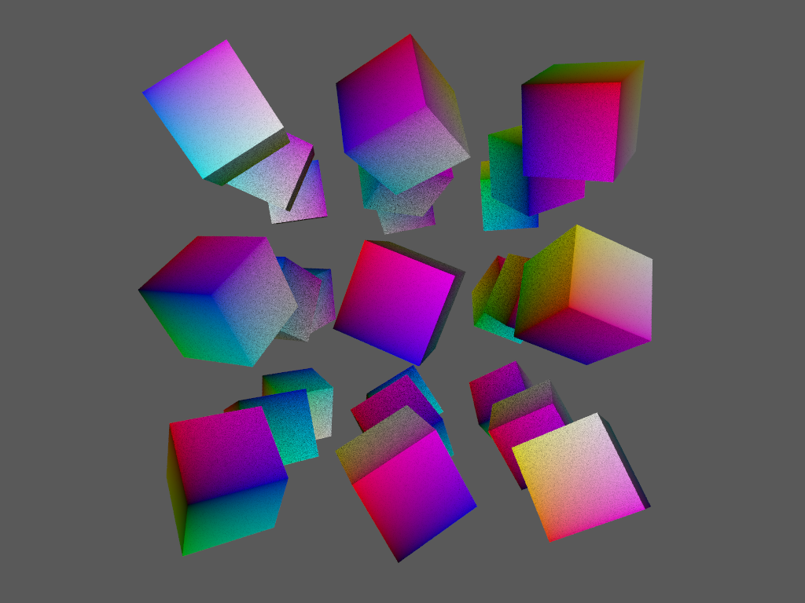

# ANARI 1.0 CTS Design Document <!-- omit in toc -->

- [Introduction](#introduction)
- [Architecture](#architecture)
  - [C++ CTS library](#c-cts-library)
  - [Python CTS API](#python-cts-api)
- [Features](#features)
  - [Render a set of known test scenes](#render-a-set-of-known-test-scenes)
    - [Define test scene format](#define-test-scene-format)
    - [Python API](#python-api)
    - [C++](#c)
    - [Example output](#example-output)
  - [Image comparison “smoke tests”](#image-comparison-smoke-tests)
    - [Python API](#python-api-1)
    - [Comparison methods](#comparison-methods)
    - [Example output](#example-output-1)
  - [Verification of object/parameter info metadata](#verification-of-objectparameter-info-metadata)
    - [Python API](#python-api-2)
    - [C++](#c-1)
    - [Example output](#example-output-2)
  - [Verification of known object properties](#verification-of-known-object-properties)
    - [Python API](#python-api-3)
    - [C++](#c-2)
    - [Example output](#example-output-3)
  - [List core extensions implemented by a device](#list-core-extensions-implemented-by-a-device)
    - [Python API](#python-api-4)
    - [C++](#c-3)
    - [Example output](#example-output-4)
  - [Aggregated test results](#aggregated-test-results)
- [References](#references)

## Q&A <!-- omit in toc -->
- Depth test is defined as Euclidean distance (not normalized). If we want to use it as metric, a suitable range needs to be defined for all or each test scene.

## Introduction
The overall goal of the ANARI 1.0 CTS is to maximally cover observable behavior from an ANARI device
implementation, which are split between visual and non-visual behaviors. In its first version the CTS should be able to render images of test scene for arbitrary ANARI devices. These renderings are compared to previously created ground truth renderings to verify if the desired outcome is achieved. The CTS is additionally able to verify the ANARI object/parameter info metadata, the setting of object parameters and the available core extensions of a device. The results of these operations can be aggregated into a PDF file or seen directly in the command line via python standard output.
## Architecture
The ANARI 1.0 CTS consists of two major parts. A C++ backend is needed, which setups the ANARI environment, loads test scenes, creates the renderings and queries the needed information from an ANARI device. A python API is used to communicate with the user, call the C++ functions to invoke ANARI calls, compare the rendered images to the ground truth with multiple metrics and provide the user with the results. To connect the python interface with the C++ backend, a binding such as pybind11[^pybind] can be used.
### C++ CTS library
The C++ library is written in C++11. A newer C++ version can also be used if the requirements for pybind11 are satisfied. The C++ library provides all ANARI functionality which is needed for the CTS.  Sample code for setting up ANARI and rendering scenes to images can already be viewed in the [main.cpp of the rendering tests](../tests/render/main.cpp). The details for the implementation of each feature is covered in the following chapters.

### Python CTS API
The python CTS API is written in Python 3.6 or higher (requirement of pybind11). It is used to parse all user input from the CLI via argparse[^argparse] and calls the needed ANARI functionality via pybind11. All I/O is handled by python, therefore the C++ backend should only return e.g. the pixel data and the python API writes the rendering to disk. All logging information of ANARI calls should also be saved to a file. The API should also be callable as a python module, so more sophisticated users can call the function from another python script instead of invoking it via CLI. The most important role of the python API is the actual image comparison between renderings form ANARI devices and the ground truth. Multiple comparison methods should be provided. The results of all API calls can be aggregated into a single PDF or shown via python standard output.

## Features
### Render a set of known test scenes
#### Define test scene format
- Scenes should be easy to generate
- Scenes should cover edge cases
- Scenes should be usable for objective structural testing
#### Python API
- Lets user define parameters for the rendering
#### C++
- Setup ANARI and render scene to image
#### Example output
- Renderer images

### Image comparison “smoke tests”
#### Python API
The python API performs the image comparison between the previously rendered scenes from an ANARI device and the ground truth. The user can customize varies parameters in regards to the comparison. A similar tool is used for the Khronos 3D Commerce Certification Program[^3DC], which can be accessed on github[^3DC-github]. The python function could look similar to this:
``` python
def compare_images(ground_truth_images, test_images, output_folder = ".", comparison_methods = ["SSIM"], thresholds = None, custom_compare_function = None)
```
`ground_truth_images` and `test_images` are the paths to the folders containing the images.\
 `output_folder` is the path to the folder where the PDF file with the results are stored. If `output_folder` is `None` or invalid, the results will only be shown via python standard output.\
 `comparison_methods` is a list of strings containing all algorithms which should be used to compare the sets of images. The list of proposed algorithms is listed in section [Comparison methods](#comparison-methods).\
 `thresholds` is a list of numbers containing the values which determine for each comparison method if the test image fails or passes the test. If `None` is given, no threshold is applied or optionally predefined thresholds are used.\
 `custom_compare_function` can be used by the user to define a custom function to compare the images. The signature should look like this:
 ```python
def custom_compare_function(ground_truth_image_pixel_data, test_image_pixel_data):
  # Custom code
  # ...
  return true, 0.9 # Boolean if passed or not and actual score
 ```
 If a custom compare function is provided, it will be used additionally to the defined comparison methods (if any are defined) and included in the final result. \
 The comparison methods should be implemented in such a way that adding new methods is well documented and straightforward. This could be achieved e.g. by a switch statement (introduced in Python 3.10) with comparison functions defined similar to the `custom_compare_function`:
 ```python
for comparison_method, threshold in zip(comparison_methods, thresholds):
  result = 0
  passed = False
  match(comparison_method):
    case 'SSIM':
      passed, result = ssim(ground_truth_image_pixel_data, test_image_pixel_data, threshold)
    case 'depth_test':
      passed, result = depth_test(ground_truth_image_pixel_data, test_image_pixel_data, threshold)
 ``` 

#### Comparison methods
For comparing the images, the metrics module of the scikit-image[^scikit-image] library is suggested. It implements the most commonly used comparison algorithms, such as mean squared error (MSE)[^mse], peak signal noise ratio (PSNR)[^psnr] or structural similarity (SSIM)[^ssim].

Since the CTS should only compare structural difference between images and disregard changes in lighting or shading, the following methods are proposed. In contrast to MSE or PSNR, which compare the pixel values of images directly, SSIM tries to mimic human perception and compares the structure of images. Therefore, the relationship between pixels is taken into account and SSIM can be used for pattern recognition between two images. SSIM does not totally disregard lighting and shading. If the difference are too big, SSIM will not be able to recognize the same patterns. To minimize this issue it is suggested to use a uniform light (e.g. a white HDR) to minimize the differences in lighting.\
If only the actual vertices should be compared, the depth test can be render to an image. This is a grayscale image as seen below which encodes the distance from each pixel to the camera as euclidean distance as defined in the ANARI specification. Since this is an ANARI core feature, every ANARI device should be able to render the depth channel. These renderings are independent from any shading or light source and only take the actual primitives into account. Therefore, these images can be compared with MSE or PSNR with a strict threshold.
<figure>
  
  <figcaption>Depth channel of instanced_cubes_0 created with anariRenderTests</figcaption>
</figure>

#### Example output
- Conformance test report as PDF showing the differences between test images and ground truth

### Verification of object/parameter info metadata
#### Python API
- Executes the verification
- Presents the results to the user
#### C++
- Queries all items via Object introspection
#### Example output
- List of all available objects/parameter info metadata
### Verification of known object properties
#### Python API
- Executes the verification
- Presents the results to the user
#### C++
- Checks if queried property values match test scene input
#### Example output
- List of invalid property values

### List core extensions implemented by a device
#### Python API
- Executes the query
- Presents the results to the user
#### C++
- Checks availability of each core extension
#### Example output
- List of all available core extensions

### Aggregated test results
- Runs all tests and creates one report containing all test cases in a single PDF file

## References
[^pybind]:https://github.com/pybind/pybind11
[^argparse]:https://docs.python.org/3/library/argparse.html
[^ssim]:https://en.wikipedia.org/wiki/Structural_similarity
[^3DC]:https://www.khronos.org/3dcommerce/certification/
[^3DC-github]:https://github.com/KhronosGroup/3DC-Certification/tree/main/evaluation
[^scikit-image]:https://scikit-image.org/
[^psnr]:https://en.wikipedia.org/wiki/Peak_signal-to-noise_ratio
[^mse]:https://en.wikipedia.org/wiki/Mean_squared_error