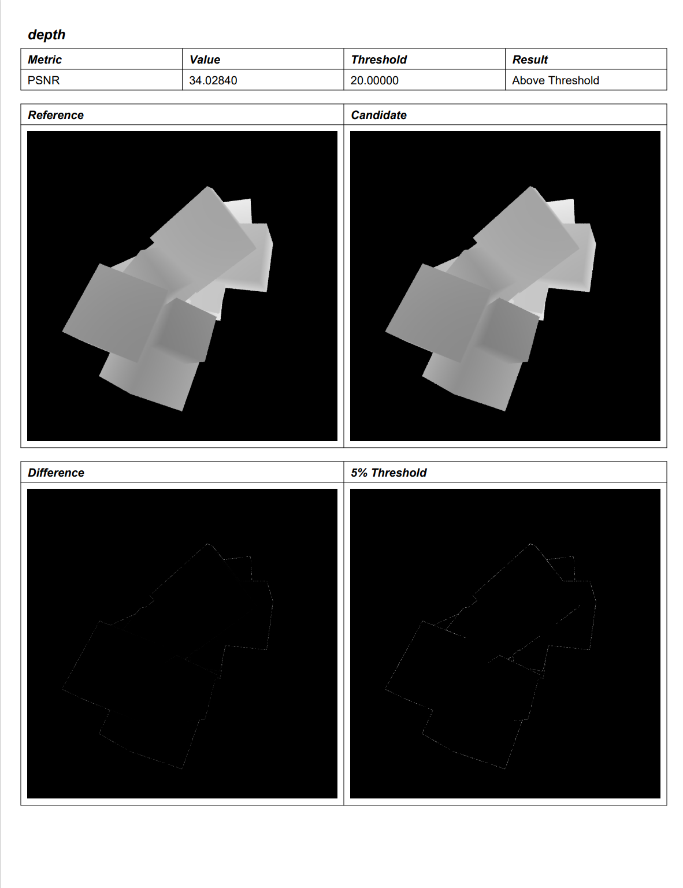

# CTS Features <!-- omit in toc -->

- [Render a set of known test scenes](#render-a-set-of-known-test-scenes)
  - [Python API](#python-api)
  - [C++](#c)
  - [Example output](#example-output)
- [Image comparison “smoke tests”](#image-comparison-smoke-tests)
  - [Python API](#python-api-1)
  - [Comparison methods](#comparison-methods)
  - [Example output](#example-output-1)
- [Verification of object/parameter info metadata](#verification-of-objectparameter-info-metadata)
  - [Python API](#python-api-2)
  - [C++](#c-1)
  - [Example output](#example-output-2)
- [Verification of known object properties](#verification-of-known-object-properties)
  - [Python API](#python-api-3)
  - [C++](#c-2)
  - [Example output](#example-output-3)
- [List ANARI features implemented by a device](#list-anari-features-implemented-by-a-device)
  - [Python API](#python-api-4)
  - [C++](#c-3)
  - [Example output](#example-output-4)
- [Aggregate test results](#aggregate-test-results)
  - [Example output](#example-output-5)
- [References](#references)


## Render a set of known test scenes
### Python API

The Python API is used by the user to invoke the rendering. The function signature looks like this:
```python
def render_scenes(anari_library, anari_device = None, anari_renderer = "default", test_scenes = "test_scenes", output = ".")
```
```bash
# Example call
.\cts.py render_scenes helide -d default -r default -t test_scenes -o .
```

This invokes the required ANARI calls for the specified device and library in the C++ backend via pybind11. If `anari_device` is set to `None`, the default device is used (first device of anariGetDeviceSubtypes). Now, all specified test scenes are rendered with the specified renderer. If no renderer is given, the default renderer is used. `test_scenes` can either be a category denoted by a path into the `test_scenes` folder or be a number of scenes denoted by a list of strings. If no scene is given, all test scenes are used by default. `output` specifies the folder in which the renderings are saved. It defaults to the folder where the script is executed from. The renderings will be arranged in the same folder structure as the test cases. Therefore, by default the images are placed next to the JSON files. The python API receives the pixel data from the C++ backend and writes the renderings to disk.

### C++
The C++ backend first sets up the ANARI device. Afterwards, all passed test scenes are initialized and rendered. The pixel data for RGBA and depth channel as well as the ANARI log messages are passed to Python via pybind11.

### Example output
<p float="left">
  
  
  
</p>
<figcaption>Renderings from sphere and quad test cases </figcaption>

## Image comparison “smoke tests”

### Python API

The Python API performs the image comparison between the previously rendered scenes from an ANARI device and the ground truth. The user can customize various parameters in regards to the comparison. The Python function could look similar to this:

```python
def compare_images(test_scenes = "test_scenes",  candidates_path = "test_scenes", output = ".", verbosity=0,comparison_methods = ["SSIM"], thresholds = None, custom_compare_function = None)
```

```bash
# Example call
.\cts.py compare_images -t test_scenes --candidates test_scenes -o . --verbose_all --comparison_methods ssim psnr --thresholds 0.7 0.5
```

- `test_scenes` is the path to the folder containing the test files + reference images.
- `candidates_path` is the path to folder containing the candidate renderings.
- `output` is the path to the folder where the PDF file with the results is stored. A subfolder called evaluation is created. If `output` is `None` the results will only be shown via Python standard output.
- `verbosity` specifies which detailed information should be shown in the report. 0 - None, 1 - Only failed tests, 2 - All tests
- `comparison_methods` is a list of strings containing all algorithms which should be used to compare the sets of images. The list of proposed algorithms is listed in section [Comparison methods](#comparison-methods).
- `thresholds` is a list of numbers containing values which determine for each comparison method whether the tested image fails or passes the test. If `None` is given,  predefined thresholds are used.
- `custom_compare_function` can be used by the user to define a custom function to compare the images with. The signature should look like this:

```python
def custom_compare_function(reference, candidate):
    # ...    
    return result > threshold, threshold, result
```

If a custom compare function is provided, it will be used additionally to the defined comparison methods (if any are defined) and included in the final result.

### Comparison methods

For comparing the images, the metrics module of the scikit-image[^scikit-image] library is used. It implements the most commonly used comparison algorithms, such as mean squared error (MSE)[^mse], peak signal noise ratio (PSNR)[^psnr] or structural similarity (SSIM)[^ssim].

Since the CTS should only compare structural difference between images and disregard changes in lighting or shading, the following methods are used. In contrast to MSE or PSNR, which compare the pixel values of images directly, SSIM tries to mimic human perception and compares the structure of images. Therefore, the relationship between pixels is taken into account and SSIM can be used for pattern recognition between two images. However, SSIM does not totally disregard lighting and shading. If the differences are too big, SSIM will not be able to recognize structurally similar patterns.\
For comparing only the actual vertices, the depth channel is rendered to an image. This is a grayscale image as seen below which encodes the distance from each pixel to the camera as euclidean distance as defined in the ANARI specification. These renderings are independent from any shading or light source and only take the actual primitives into account. Therefore, these images are compared with PSNR with a strict threshold.

### Example output

<figure>
  

</figure>

Screenshot of example report.

## Verification of object/parameter info metadata
The CTS is able to query all static object/parameter info metadata of a library. This can be used to check which types and features are implemented by an ANARI library.
### Python API
The Python API is used by the user to invoke the query. The function signature looks like this:
```python
def query_metadata(anari_library, type = None, subtype = None, skipParameters = False, info = False)
```
```bash
# Example call
.\cts.py query_metadata helide --type ANARI_GEOMETRY --subtype cone --info
```

This invokes the required ANARI calls for `anari_library` in the C++ backend via pybind11. The queried information will be displayed via Python standard output. `type`, `subtype`and `skipParameters` can be used to limit the output to the specified types. `info` can be enabled to show more detailed information.  

### C++
The code of the `anariInfo` tool was refactored for this task to return a string instead of writing directly to the output via `printf`.

### Example output
Example output for the example library:
```
Devices:
   example
Device "example":
   Subtypes:
      ANARI_CAMERA: omnidirectional orthographic perspective
      ANARI_GEOMETRY: cone curve cylinder quad sphere triangle
      ANARI_LIGHT: directional point spot
      ANARI_MATERIAL: matte transparentMatte
      ANARI_RENDERER: default scivis ao pathtracer debug raycast rayDir
      ANARI_SAMPLER: image1D image2D image3D primitive transform
      ANARI_SPATIAL_FIELD: structuredRegular
      ANARI_VOLUME: scivis
   Parameters:
      ANARI_CAMERA omnidirectional:
         * name                      ANARI_STRING
         * position                  ANARI_FLOAT32_VEC3
         * direction                 ANARI_FLOAT32_VEC3
         * up                        ANARI_FLOAT32_VEC3
         * transform                 ANARI_FLOAT32_MAT3x4
         * imageRegion               ANARI_FLOAT32_BOX2
         * apertureRadius            ANARI_FLOAT32
         * focusDistance             ANARI_FLOAT32
         * stereoMode                ANARI_STRING
         * interpupillaryDistance    ANARI_FLOAT32
         * layout                    ANARI_STRING

...
```

## Verification of known object properties
The CTS is able to check if output object properties are correct. This is done by loading the test scenes and verifying if the properties match the excepted values from the JSON file.
### Python API

The Python API is used by the user to invoke the check. The function signature looks like this:
```python
def check_object_properties(anari_library, anari_device = None, test_scenes = "test_scenes")
```
```bash
# Example call
.\cts.py check_object_properties helide -d default -t test_scenes
```
This invokes the required ANARI calls for the specified device and test scenes (see [Render a set of known test scenes](#python-api))) in the C++ backend via pybind11. If `anari_device` is set to `None`, the default device is used (first device of `anariGetDeviceSubtypes`). A list of all properties will be displayed via Python standard output showing the result.
### C++
The C++ backend will first setup the ANARI device and load the test scene. It will check the properties `bounds` of `Group`, `Instance` and `World`. The `waitMask` parameter is set to `ANARI_WAIT`. The correct values are generated and written in the test scene.
The results will be returned to the Python API.

### Example output

```
Feature ANARI_KHR_GEOMETRY_CURVE is not supported
Scene D:\reps\ANARI-SDK\cts\test_scenes\primitives\curve\curve.json is not supported
test_scenes\primitives\cone\cone_soup: Worlds bounds do not match!
MIN X mismatch: Is -0.11385399103164673. Should be -0.21904073655605316 ± 0.07143060490489006
MAX X mismatch: Is 1.0190626382827759. Should be 1.209571361541748 ± 0.07143060490489006
MIN Y mismatch: Is -0.13137219846248627. Should be -0.25435739755630493 ± 0.07117505371570587
MIN Z mismatch: Is 0.012333530932664871. Should be -0.08156748116016388 ± 0.06556123271584512

```

## List ANARI features implemented by a device
The CTS is able to list all ANARI features and show which ones are implemented by the ANARI device.
### Python API
The Python API can be invoked by a function similar to this:
```python
def query_features(anari_library, anari_device = None)
```
```bash
# Example call
.\cts.py query_features helide -d default
```
If no `anari_device` is specified, the default device is used.
### C++
The C++ backend sets up the ANARI device and calls `anariGetObjectFeatures` on it. Afterwards, it is checked if each feature is included in the supported features and the result is returned.

### Example output
```
------------------------------------------  -----
ANARI_KHR_CAMERA_OMNIDIRECTIONAL            False
ANARI_KHR_CAMERA_ORTHOGRAPHIC               True
ANARI_KHR_CAMERA_PERSPECTIVE                True
ANARI_KHR_GEOMETRY_CONE                     True
ANARI_KHR_GEOMETRY_CURVE                    True
ANARI_KHR_GEOMETRY_CYLINDER                 True
ANARI_KHR_GEOMETRY_QUAD                     True
ANARI_KHR_GEOMETRY_SPHERE                   True
ANARI_KHR_GEOMETRY_TRIANGLE                 True
ANARI_KHR_LIGHT_DIRECTIONAL                 False
ANARI_KHR_LIGHT_POINT                       True
ANARI_KHR_LIGHT_SPOT                        False
ANARI_KHR_MATERIAL_MATTE                    True
ANARI_KHR_MATERIAL_TRANSPARENT_MATTE        True
ANARI_KHR_SAMPLER_IMAGE1D                   True
ANARI_KHR_SAMPLER_IMAGE2D                   False
ANARI_KHR_SAMPLER_IMAGE3D                   False
ANARI_KHR_SAMPLER_PRIMITIVE                 False
ANARI_KHR_SAMPLER_TRANSFORM                 False
ANARI_KHR_SPATIAL_FIELD_STRUCTURED_REGULAR  True
ANARI_KHR_VOLUME_SCIVIS                     True
ANARI_KHR_LIGHT_RING                        False
ANARI_KHR_LIGHT_QUAD                        False
ANARI_KHR_LIGHT_HDRI                        False
ANARI_KHR_FRAME_CONTINUATION                False
ANARI_KHR_AUXILIARY_BUFFERS                 False
ANARI_KHR_AREA_LIGHTS                       False
ANARI_KHR_STOCHASTIC_RENDERING              False
ANARI_KHR_TRANSFORMATION_MOTION_BLUR        False
ANARI_KHR_ARRAY1D_REGION                    False
------------------------------------------  -----
```

## Aggregate test results
The Python API is able to call all previously defined features and accumulate their results in a PDF file. The API function can be defined as:
```python
def create_report(library, device = None, renderer = "default", test_scenes = "test_scenes", output = ".", verbosity = 0, comparison_methods = ["ssim"], thresholds = None, custom_compare_function = None)
```
```bash
# Example call
.\cts.py create_report helide -d default -r default -t test_scenes -o . --verbose_all --comparison_methods ssim --thresholds 0.7 
```
This function runs all tests with their respective parameters. After all tests are run their results are accumulated into a PDF and stored inside the subfolder evaluation in the output path. This is done with the `reportlab` library. The first page contains a summary of all tests. Afterwards, the results from `query_features` and `query_metadata` are shown. Depending on the verbosity level, the detailed results of each test are shown. These contain the image comparison, the frame duration and the result from `check_object_properties`.

### Example output

<figure>
  

</figure>

First page of an example report

## References

[^pybind]: https://github.com/pybind/pybind11
[^argparse]: https://docs.python.org/3/library/argparse.html
[^ssim]: https://en.wikipedia.org/wiki/Structural_similarity
[^scikit-image]: https://scikit-image.org/
[^psnr]: https://en.wikipedia.org/wiki/Peak_signal-to-noise_ratio
[^mse]: https://en.wikipedia.org/wiki/Mean_squared_error
